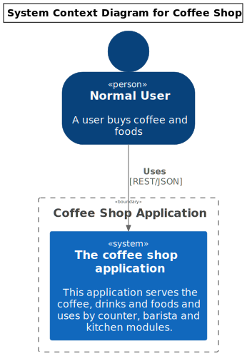
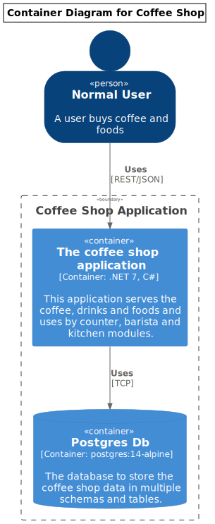
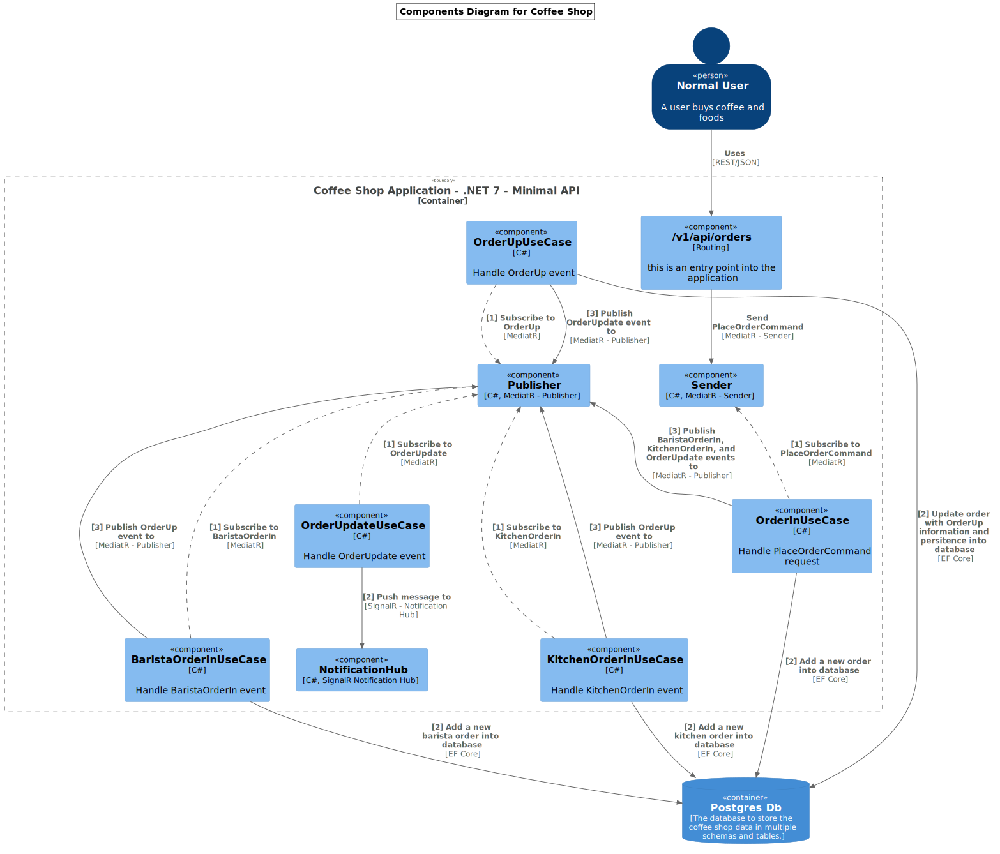

# coffeeshop-modular

.NET coffee shop application with modular approach

# Software System Diagram



# Container Diagram



# Component Diagram




# Start project with docker-compose

```bash
> docker compose up
```

# Start project with nomad at [here](nomad/README.md)

> This project mainly based on https://github.com/quarkuscoffeeshop/quarkuscoffeeshop-majestic-monolith, and customized some parts to adapt with .NET 7
